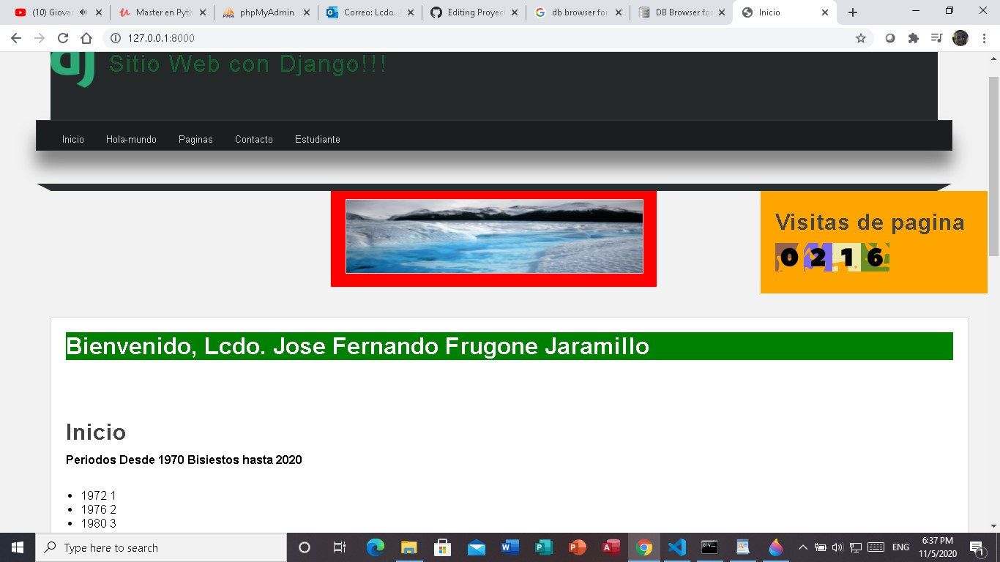
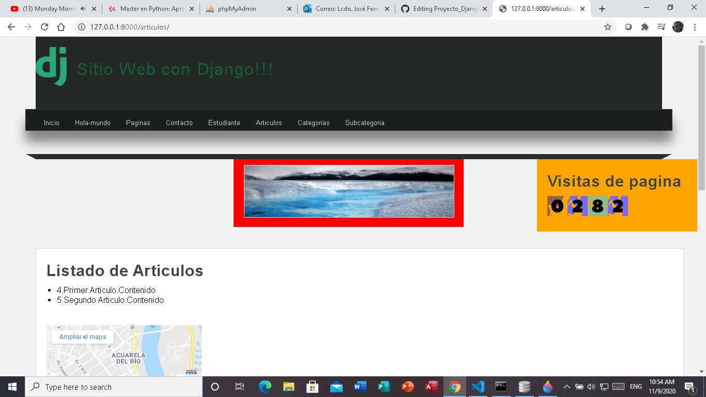

# Django (Python)

  

Vamos a definir lo que es Django primeramente:

Django es un framework de desarrollo web de codigo abierto, escrito en Python que respeta el patron de diseno conocido como "MVC (Modelo Vista Controlador) fue desarrollado en su origen para gestionar varias paginas orientadas a noticias de la World Company de Lawrences de Kansas, fue liberada al pablico bajo una licencia BSD en julio 2005.

https://es.wikipedia.org/wiki/Django_(framework)

Modelo Vista Controlador (MVC)

Modelo-vista-controlador es un patron de arquitectura de software que separa los datos y principalmente lo que es la logica de los negocios de una aplicacion de su representacion y el modulo encargado de gestionar los eventos y las comunicaciones.

https://es.wikipedia.org/wiki/Modelo%E2%80%93vista%E2%80%93controlador

Instalacion de Django

Para la instalacion de Django lo que tienes que hacer primeramente desde la ventana de comandos verificar si esta instalado Python en la computadora para ello desde la ventana de comandos digitas python --version y das enter te da la version del python que tienes instalada, para instalar django deber digitar pip install Django==3.1.3 y dar enter esperar de que se realice la instalacion de Django

https://www.djangoproject.com/download/

Crear nuestro proyecto de Django.-

  

Para crear nuestro proyecto de Django desde la ventana de comando del sistema operativo de Windows en mi caso ponemos cd wamp64/www/Curso_Udemy_Master_Python/22-django
para crear el proyecto lo creamos de la siguiente manera django-admin startproject AprendiendoDjango, para este caso nuestro proyecto se llama "AprendiendoDjango"

https://docs.djangoproject.com/en/3.1/intro/tutorial01/

Una vez creada el proyecto de Django en la computadora hay que crear la base de datos que por defecto crea una base de datos de sqllite3, poniendo python manage.py migrate

Crear una app de Django

Una app es una aplicacion que se va a ejecutar dentro la aplicacion de Python, que tiene que estar especificado dentro del archivo de configuracion settings.py de Python en la parte que dice installeds_apps, para crear la aplicacion se digita python manage.py startapp miapp, y crear la aplicacion

https://docs.djangoproject.com/en/3.1/intro/tutorial01/

Routing y vistas en Django
Crear vistas y rutas.-

  

Para crear las rutas y vistas en el archivo views.py de la aplicacion en este caso mi apps se crear las diferentes vistas, para ello podermos hacer uso del paquete HttpResponse, o render de Django para llamar luego a los diferentes template., el siguiente codigo:

from django.shortcuts import render, HttpResponse, redirect
from miapp.models import Article, Category, SubCategory

# Create your views here.
# MVC - Modelo Vista Controlador -> Acciones(metodos)
# MVT - Modelo Template Vista -> Acciones(metodos)

layout = """

        <h1>Sitio web con Django | Lcdo Jose Fernando Frugone</h1>
        

        <ul>
            <li>
                <a href="/inicio">Inicio</a>
            </li>
            <li>
                <a href="/hola-mundo">Hola-mundo</a>
            </li>
            <li>
                <a href="/paginas-pruebas">Paginas</a>
            </li>
            <li>
                <a href="/contacto/Lcdo./Jose Fernando/Frugone Jaramillo">Contacto</a>
            </li>
            <li>
                 <a href="/estudiante/Luis Andres/Garcia Moran">Estudiante</a>
            </li>

        </ul>
        

"""

def index(request, nombre=""):

    year = 1970

    bisiesto = []

    while year <= 2020:

        if year % 4 == 0:

            bisiesto.append(f"{str(year)}")
      
        year += 1

    dato1 = 1950
    periodo = range(dato1, 2021)
    nombre = "Lcdo. Jose Fernando Frugone Jaramillo"

    return render(request, 'index.html', {
        'titulo':'Inicio',
        'nombre':nombre,
        'bisiesto':bisiesto,
        'periodo':periodo
        
    }) 

def hola_mundo(request):

    return render(request, 'hola_mundo.html') 

def pagina(request, redirigir = 0):

    
    if redirigir == 1:
        return redirect('/index')
    
    elif redirigir == 2:
        return redirect('/hola-mundo')
    
    elif redirigir == 3:
        return redirect('contacto',profesion="Lcdo",nombre="Jose Fernando",apellido="Frugone Jaramillo")
    
    elif redirect == 4:
        return redirect('estudiante',nombre="Juan Pablo",apellido="Castro Gonzalez")        

    return render(request, 'pagina.html')

def contacto(request, profesion="", nombre="", apellido=""):

    return render(request, 'contacto.html', {
        'titulo':'Pagina de contacto',
        'profesion':profesion,
        'nombre':nombre,
        'apellido':apellido
       
    })

def estudiante(request, nombre="", apellido=""):

    lista = [{
        'nombre':'Antonio',
        'apellido':'Garcia'
    },
    {
        'nombre':'Pablo',
        'apellido':'Rosales'
    },
    {
        'nombre':'Alejandro',
        'apellido':'Andrade'
    },
    {
        'nombre':'Luis',
        'apellido':'Castro'
    },
    {
        'nombre':'Eduardo',
        'apellido':'Medina'
    },
    {
        'nombre':'Carlos',
        'apellido':'Gonzalez'
    }
    ]

    return render(request, 'estudiante.html', {
        'titulo':'Pagina de estudiante',
        'lista':lista
    })

def crear_articulo(request):

    articulo = Article(
        title = 'Primer Articulo',
        content = 'Contenido del articulo',
        public = True,

    )

    articulo.save()
    
    return HttpResponse("Usuario creado :")                        

las rutas se especifican dentro del proyecto de Django en el archivo de configuracion de las rutas urls.py, asi de esta manera:

"""AprendiendoDjango URL Configuration

The `urlpatterns` list routes URLs to views. For more information please see:
    https://docs.djangoproject.com/en/3.1/topics/http/urls/
Examples:
Function views
    1. Add an import:  from my_app import views
    2. Add a URL to urlpatterns:  path('', views.home, name='home')
Class-based views
    1. Add an import:  from other_app.views import Home
    2. Add a URL to urlpatterns:  path('', Home.as_view(), name='home')
Including another URLconf
    1. Import the include() function: from django.urls import include, path
    2. Add a URL to urlpatterns:  path('blog/', include('blog.urls'))
"""
from django.contrib import admin
from django.urls import path

# importar mi app con mi vista
from miapp import views

urlpatterns = [
    path('admin/', admin.site.urls),
    path('', views.index, name="index"),
    path('inicio/', views.index, name="inicio"),
    path('inicio/<str:nombre>',views.index, name="inicio"),
    path('hola-mundo/', views.hola_mundo, name="hola_mundo"),
    path('paginas-pruebas/', views.pagina, name="pagina"),
    path('paginas-pruebas/<int:redirigir>', views.pagina, name="pagina"),
    path('contacto/', views.contacto, name="contacto"),
    path('contacto/<str:profesion>/<str:nombre>', views.contacto, name="contacto"),
    path('contacto/<str:profesion>/<str:nombre>/<str:apellido>', views.contacto, name="contacto"),
    path('estudiante/', views.estudiante, name="estudiante"),
    path('estudiante/<str:nombre>', views.estudiante, name="estudiante"),
    path('estudiante/<str:nombre>/<str:apellido>/', views.estudiante, name="estudiante"),
    path('crear-articulo/<str:title>/<str:content>/<str:public>/', views.crear_articulo, name="crea_articulo"),
    path('editar-articulo/<int:id>/<str:name>/<str:description>/', views.editar_articulo, name="editar_articulo"),
    path('crear-categori/<str:name>/<str:description>/', views.crear_category, name="crea_categoria"),
    path('editar-categori/<int:id>/<str:name>/<str:description>/', views.editar_categori, name="editar_categori"),
    path('categoria-lista/<str:name>/<str:description>/', views.lista_categori, name="lista_categori"),
    path('crear-subcategori/<str:name>/<str:description>/', views.crear_sub_category, name="crea_subcategori"),
    path('editar-subcategori/<int:id>/<str:name>/<str:description>/', views.editar_subcategoria, name="editar_subcategori"),
    path('subcategori-lista/<str:name>/<str:description>/', views.lista_subcategory, name="lista_subcategori"),
    path('mostrar-articulo/<str:title>/<str:content>/', views.articulo, name="mostrar"),
    path('crea-persona/<str:apellidos>/<str:nombres>/<str:profesion>/<str:certificado>/<str:pais>/<str:provincia>/<str:direccion>/<str:correo>/<str:telefono>/',views.persona, name="persona"),
    path('editar-persona/<int:id>/<str:apellidos>/<str:nombres>/<str:profesion>/<str:certificado>/<str:pais>/<str:provincia>/<str:direccion>/<str:correo>/<str:telefono>/', views.editar_persona, name="editar_persona"),
    path('lista/<str:apellidos>/<str:nombres>/<str:pais>/<str:provincia>/', views.lista_persona, name="mostrar_p")
    
]

https://docs.djangoproject.com/en/3.1/intro/tutorial01/

Plantillas y Templates de Django

  

  

  

Templates separadas.- Una vista es un tipo de pagina WEB que el servidor generalmente especifica funciones y tiene un template especifico los template se especifica dentro de la carpeta templates de la aplicacion de Django, para este caso vamos a crear varios templates para mi proyecto "index.html", "layout.html", "pagina.html", "contacto.html", que son fragmentos de codigo HTML para ser usado en Python

https://docs.djangoproject.com/en/3.1/intro/tutorial03/

Layout, bloques y herencias.- Dentro de los templates vamos hacer un template pricipal que los demas template van a heredad su estructura de su pagina WEB definimos el template "layout.html", de la siguiente manera:


<!DOCTYPE html>
<html lang="es">

<head>
    <meta charset="utf-8" />
    <title>
        
        <!-- Bloque de codigo que viene del template-->
        

    </title>

    <link rel="stylesheet" type="text/css" href="" />

</head>

<body>

    <!-- Cabecera de la pagina-->
    <header>
        

            <!-- Logo Django-->
            
            <h1>Sitio Web con Django!!!</h1>

        

    </header>

    <nav>

        <ul>
            <li>
                <a href="">Inicio</a>
            </li>
            <li>
                <a href="">Hola-mundo</a>
            </li>
            <li>
                <a href="">Paginas</a>
            </li>
            <li>
                <a href="">Contacto</a>
            </li>
            <li>
                <a href="">Estudiante</a>
            </li>

        </ul>

    </nav>

    

        
        
        
    

    

        <aside>

                <h2 class="title">Visitas de pagina</h2>

                

        </aside>

    
    

    

         

    

    

        

            
            <!-- Codigo que viene del template-->
            <strong>Contenido del bloque Original!!</strong>

            

            

                <iframe src="https://www.google.com/maps/embed?pb=!1m14!1m12!1m3!1d15948.13508653324!2d-79.88568169999999!3d-2.1407391000000002!2m3!1f0!2f0!3f0!3m2!1i1024!2i768!4f13.1!5e0!3m2!1ses-419!2sec!4v1604331730668!5m2!1ses-419!2sec" width="300" height="200" frameborder="0" style="border:0;" allowfullscreen="" aria-hidden="false" tabindex="0"></iframe>                 

            
            

    
        

    

    <footer>
        Master en Python &copy; Lcdo Jose Frugone - 
    </footer>

</body>

</html>

Para definir un template que va a heredar la estructura del template y las caractereristicas del archivo "layout.html", definimos de esta manera:

Para este ejemplo al archivo "index.html"

 {{titulo}} 



<!-- Esto es un comentario en html-->






   
   {{nombre|saludo|safe}}



   
No existe nombre

   




<h1 class="title">{{titulo}}</h1>

<strong>Periodos Desde 1970 Bisiestos hasta 2020</strong>



    
   <ul>

      

         <li>{{bisi}} {{forloop.counter}}</li>

      

         
No hay datos de  bisiestos
     

          

   </ul>

    



   
No se ha enviado datos para los periodos bisiestos



 
<h3>Periodos bisiestos desde 1950 hasta el 2020</h3>



   <ul>

      

         

           <li>{{dato}}</li>

         

       
      

           <strong>No se ha enviado datos</strong>

           

   </ul>



   <h2>
No hay datos para mostrar
</h2>



 



https://docs.djangoproject.com/en/3.1/intro/tutorial03/

Estilo y apariencia visual de nuestro sitio web.

Hoja de estilos para nuestro sitio web "styles.css"

/* Estilos generales */

*{
    margin: 0px;
    padding: 0px;
    font-family: sans-serif, Arial, Helvetica;
    text-decoration: none;
}

body{
    background-color: #F2F2F2;

}

p, h2, h3, ul{
    margin-top: 5px;
    margin-bottom: 5px;
    
}

ul, ol{
    margin-left: 20px;
    margin-bottom: 20px;
}

/* Estilos cabecera */

header{
    width: 1212px;
    height: 140px;
    background-color: #232828;
    margin: 0px auto;

}

#logotigo{
    width: 60%;
    height: 140px;
    margin: 0px auto;
    padding-top: 10px;

}

#logotipo img{
    display: block;
    width: 60px;
    float: left;
    margin-top: 20px;

}

#logotipo h1{
    display: block;
    float: left;
    letter-spacing: 2px;
    margin-top: 45px;
    margin-left: 20px;
    font-weight: lighter;
    color: #145e30 
}

/* Estilos barra de navegacion */

nav{
    width: 1250px;
    height: 40px;
    background-color: #1B1E1F;
    border: 1px solid #333333;
    margin: 0 auto;
    margin-bottom: 45px;
    box-shadow: 0px 22px 22px gray;
    font-size: 13px;

}

nav ul{
    list-style: none;
    text-decoration: none;

}

nav ul li{
    line-height: 40px;
    float: left;
    
}

nav ul li a{
    display: block;
    padding-left: 15px;
    padding-right: 15px;
    color: #d1d4d6;

}

nav ul li a:hover{
    background: #145e30;
    box-shadow: 0px 0px 5px #333333 inset;
    color: white;
    transition: all 300ms;
}

/* Contador de visitas */
contador-visitas{
    display: block;
    width: 20%;
    height: 120px;
    margin-top: 10px;
    margin-bottom: 10px;
    margin: 0 auto;
    float: right;

}

.barra{
    width: 1250px;
    margin: 0 auto;
   
 
   
}

.esquina-izquierda{
    display: block;
    border-left: 20px solid transparent;
    border-top: 10px solid #2B2F30;
    float: left;

}

.esquina-derecha{
    display: block;
    border-right: 20px solid transparent;
    border-top: 10px solid #2B2F30;
    float: right;
    
}

.relleno-barra{
    display: block;
    width: 1210px;
    background: #282F30;
    height: 10px;
    float: left;

}

/* Estilos al contenido central */

#content{
    width: 1212px;
    min-height: 500px;
    margin: 0px auto;
    margin-bottom: 30px;
    margin-top: 40px;

}

.box{
    background: white;
    width: 100%;
    min-height: 930px;
    padding: 20px;
    border: 1px solid #ddd;
    border-radius: 2px;
    margin: 0 auto;

}

.box-imagen{
    background: red;
    width: 30%;
    height: 100px;
    padding: 20px;
    border: 1px solid #ddd;
    border-radius: 2px;
    margin: 0 auto;

}

.box mapa-lugar{
    width: 40%;
    height: 300px;
    padding: 20px;
    border: 1px solid #145e30;
    border-radius: 2px;
    margin: 0 auto;
}

.box mapa-lugar iframe{
    width: 40%;
    height: 200px;
    padding: 20px;
    border: 1px solid #145e30;
    border-radius: 2px;
    margin-top: 20px;
    margin-bottom: 20px;
    margin: 0 auto;
    float: right;
}

.box-imagen img{
    width: 100%;
    height: 100px;
    float: left;
    border: 1px solid #ddd;
    margin: 0 auto;
}

.title{
    color: #444;
    letter-spacing: 1px;
    font-size: 30px;
    margin-bottom: 10px;
    margin-top: 5px;
}

aside{
    float: right;
    width: 20%;
    padding: 20px;
    min-height: 100px;
    margin: 0 auto;
    background: orange;
}

/* Dando estilo al pie de pagina */

footer{
    width: 1250px;
    background-color: #181E1F;
    border: 1px solid #333;
    color: #d1d4d6;
    text-align: center;
    margin: 0 auto;
    padding-top: 20px;
    padding-bottom: 10px;
    box-shadow: 0px 0px 20px gray;

}

Modelos y Bases de Dato de Django

Pylint para Django.

Para verificar la base de datos que usa por defecto Django revisamos el archivo settings.py que viene por defecto en la instalacion de Django, que tenemos lo siguiente:

"""
Django settings for AprendiendoDjango project.

Generated by 'django-admin startproject' using Django 3.1.2.

For more information on this file, see
https://docs.djangoproject.com/en/3.1/topics/settings/

For the full list of settings and their values, see
https://docs.djangoproject.com/en/3.1/ref/settings/
"""

from pathlib import Path

# Build paths inside the project like this: BASE_DIR / 'subdir'.
BASE_DIR = Path(__file__).resolve().parent.parent

# Quick-start development settings - unsuitable for production
# See https://docs.djangoproject.com/en/3.1/howto/deployment/checklist/

# SECURITY WARNING: keep the secret key used in production secret!
SECRET_KEY = 'edbs%n-g7^@r+@#6e%_o!luofdtebd6x7_6(hbsldt5y8f)j0c'

# SECURITY WARNING: don't run with debug turned on in production!
DEBUG = True

ALLOWED_HOSTS = []

# Application definition

INSTALLED_APPS = [
    'django.contrib.admin',
    'django.contrib.auth',
    'django.contrib.contenttypes',
    'django.contrib.sessions',
    'django.contrib.messages',
    'django.contrib.staticfiles',
    'miapp'
]

MIDDLEWARE = [
    'django.middleware.security.SecurityMiddleware',
    'django.contrib.sessions.middleware.SessionMiddleware',
    'django.middleware.common.CommonMiddleware',
    'django.middleware.csrf.CsrfViewMiddleware',
    'django.contrib.auth.middleware.AuthenticationMiddleware',
    'django.contrib.messages.middleware.MessageMiddleware',
    'django.middleware.clickjacking.XFrameOptionsMiddleware',
]

ROOT_URLCONF = 'AprendiendoDjango.urls'

TEMPLATES = [
    {
        'BACKEND': 'django.template.backends.django.DjangoTemplates',
        'DIRS': [],
        'APP_DIRS': True,
        'OPTIONS': {
            'context_processors': [
                'django.template.context_processors.debug',
                'django.template.context_processors.request',
                'django.contrib.auth.context_processors.auth',
                'django.contrib.messages.context_processors.messages',
            ],
        },
    },
]

WSGI_APPLICATION = 'AprendiendoDjango.wsgi.application'

# Database
# https://docs.djangoproject.com/en/3.1/ref/settings/#databases

DATABASES = {
    'default': {
        'ENGINE': 'django.db.backends.sqlite3',
        'NAME': BASE_DIR / 'db.sqlite3',
    }
}

# Password validation
# https://docs.djangoproject.com/en/3.1/ref/settings/#auth-password-validators

AUTH_PASSWORD_VALIDATORS = [
    {
        'NAME': 'django.contrib.auth.password_validation.UserAttributeSimilarityValidator',
    },
    {
        'NAME': 'django.contrib.auth.password_validation.MinimumLengthValidator',
    },
    {
        'NAME': 'django.contrib.auth.password_validation.CommonPasswordValidator',
    },
    {
        'NAME': 'django.contrib.auth.password_validation.NumericPasswordValidator',
    },
]

# Internationalization
# https://docs.djangoproject.com/en/3.1/topics/i18n/

LANGUAGE_CODE = 'en-us'

TIME_ZONE = 'UTC'

USE_I18N = True

USE_L10N = True

USE_TZ = True

# Static files (CSS, JavaScript, Images)
# https://docs.djangoproject.com/en/3.1/howto/static-files/

STATIC_URL = '/static/'

En la aplicacion de Visual Studio Code tenemos que tener instalada la aplicacion de Django, y la de Python, para instalar pylint de Django desde la ventana de comandos de Windows digitamos pylint install pylint-django y damos enter se procede a instalar pylint de django.

Una vez instalado el pylint de Django en el Visual Studio Code para hacer referencia de este modulo del menu escogemos File (del visual Studio Code), del submenu que aparece seleccionamos "Preferencices", luego settings nos aparece vamos opciones en donde buscamos pylint, que por defencto dice pylint, que lo ponemos a pylint-django para que lo coja.

Crear modelos.- Es un diseno que define las tablas que se van a crear en la base de datos.Lo modelos se crean como en una clase y como sabemos que es un modelo (porque hace uso de la libreria models.Model) en la clase, tenemos los siguientes modelos.

  

  

  

from django.db import models

# Create your models here.

class Article(models.Model):
    title = models.CharField(max_length=200)
    content = models.TextField()
    image = models.ImageField(default='null')
    public = models.BooleanField(default=True)
    created_at = models.DateTimeField(auto_now_add=True)
    updated_at = models.DateTimeField(auto_now=True)

class Category(models.Model):
    name = models.CharField(max_length=150)
    description = models.CharField(max_length=250)
    created_at = models.DateField()

class SubCategory(models.Model):
    name = models.CharField(max_length=250)
    description = models.CharField(max_length=200)
    created_at = models.DateField()

class Question(models.Model):
    question_text = models.CharField(max_length=200)
    pub_date = models.DateTimeField('date published')

class Choice(models.Model):
    question = models.ForeignKey(Question, on_delete=models.CASCADE)
    choice_text = models.CharField(max_length=200)
    votes = models.IntegerField(default=0)        
    
    
Los modelos se definen dentro de cada apolicacion en el archivo "models.py" de la aplicacion.
https://docs.djangoproject.com/en/3.1/intro/tutorial02/

Crear tablas en base de modelo para crear tablas en base en modelo lo primero que tenemos que hacer es verificar en el archivo setting.py del proyecto de Django en este caso "AprendiendoDjango" que este agregado en las aplicaciones instaladas installed_app el proyecto en este caso "miapp", los modelos estan a nivel de la aplicacion en el archivo models.py de la aplicacion "miapp", y tenemos el siguiente codigo de los modelos:

from django.db import models

# Create your models here.

class Article(models.Model):
    title = models.CharField(max_length=200)
    content = models.TextField()
    image = models.ImageField(default='null')
    public = models.BooleanField(default=True)
    created_at = models.DateTimeField(auto_now_add=True)
    updated_at = models.DateTimeField(auto_now=True)

class Category(models.Model):
    name = models.CharField(max_length=150)
    description = models.CharField(max_length=250)
    created_at = models.DateField()

class SubCategory(models.Model):
    name = models.CharField(max_length=250)
    description = models.CharField(max_length=200)
    created_at = models.DateField()

class Question(models.Model):
    question_text = models.CharField(max_length=200)
    pub_date = models.DateTimeField('date published')

class Choice(models.Model):
    question = models.ForeignKey(Question, on_delete=models.CASCADE)
    choice_text = models.CharField(max_length=200)
    votes = models.IntegerField(default=0)
    

Desde la ventana de comandos del sistema de Windows digitamos primeramente python manage.py help, luego python manage.py makemigrations

  

como en este caso se va a agregar otras tablas en la base de datos volvemos a digitar python manage.py makemigrations , y nos aparece la siguiente pantalla:

  

Y luego para generar los comandos necesarios para poder crear las tablas en la base de datos utilizamos el comando python manage.py sqlmigrate miapp 0006 (que es el diseno de las tablas que se basa para la migracion en este caso la migracion 0006) tenemos en la carpeta de migraciones lo siguiente:

# Generated by Django 3.1.2 on 2020-11-05 23:11

from django.db import migrations, models
import django.db.models.deletion

class Migration(migrations.Migration):

    dependencies = [
        ('miapp', '0005_auto_20201105_0026'),
    ]

    operations = [
        migrations.CreateModel(
            name='Question',
            fields=[
                ('id', models.AutoField(auto_created=True, primary_key=True, serialize=False, verbose_name='ID')),
                ('question_text', models.CharField(max_length=200)),
                ('pub_date', models.DateTimeField(verbose_name='date published')),
            ],
        ),
        migrations.CreateModel(
            name='Choice',
            fields=[
                ('id', models.AutoField(auto_created=True, primary_key=True, serialize=False, verbose_name='ID')),
                ('choice_text', models.CharField(max_length=200)),
                ('votes', models.IntegerField(default=0)),
                ('question', models.ForeignKey(on_delete=django.db.models.deletion.CASCADE, to='miapp.question')),
            ],
        ),
    ]

Al digitar desde la ventana de comandos de windows python manage.py sqlmigrate miapp 0006 (pero logicamente tienes que estar dentro de la carpeta de proyecto de Django para ejecutarlo y genero el siguiente codigo):

  

Pero aun no se muestro estas tablas lo unico que hace es preparar el codigo para crear en la tabla para crear las tablas digitables python manage.py migrate, que nos aparece lo siguiente:

  

Para comprobar que esta agregado estas tablas a la base de datos para eso existe una aplicacion que se llama "DB Browser for Sqlite", para poder descargarlo desde la pagina WEB:

https://sqlitebrowser.org/

para descargarlos nos vamos a la opcion download y buscamos la version para nuestro sistema operativo de cuantos bits es el sistema operativo en este caso 64 bits

  

Guardar datos en la base de datos usando los modelos.-
Para guardar datos de la base de datos usando los modelos para ellos usamos los las vistas que tenemos en el archivo views.py creamos una nueva vista (funcion) que para ello vamos a usar el primer modelo que hemos agregado que se llama "Article", y definimos la funcion para guardar que se llama "crear_articulo"

tenemos que importar los modelos que se ha creado en la base de datos en la vista
from miapp.models import Article, Category, SubCategory

en el archivo del proyecto principal de Django "urls.py", definimos la ruta de la vista que va a agregar, ponemos de la siguiente manera:

"""AprendiendoDjango URL Configuration

The `urlpatterns` list routes URLs to views. For more information please see:
    https://docs.djangoproject.com/en/3.1/topics/http/urls/
Examples:
Function views
    1. Add an import:  from my_app import views
    2. Add a URL to urlpatterns:  path('', views.home, name='home')
Class-based views
    1. Add an import:  from other_app.views import Home
    2. Add a URL to urlpatterns:  path('', Home.as_view(), name='home')
Including another URLconf
    1. Import the include() function: from django.urls import include, path
    2. Add a URL to urlpatterns:  path('blog/', include('blog.urls'))
"""
from django.contrib import admin
from django.urls import path

# importar mi app con mi vista
from miapp import views

urlpatterns = [
    path('admin/', admin.site.urls),
    path('', views.index, name="index"),
    path('inicio/', views.index, name="inicio"),
    path('inicio/<str:nombre>',views.index, name="inicio"),
    path('hola-mundo/', views.hola_mundo, name="hola_mundo"),
    path('paginas-pruebas/', views.pagina, name="pagina"),
    path('paginas-pruebas/<int:redirigir>', views.pagina, name="pagina"),
    path('contacto/', views.contacto, name="contacto"),
    path('contacto/<str:profesion>/<str:nombre>', views.contacto, name="contacto"),
    path('contacto/<str:profesion>/<str:nombre>/<str:apellido>', views.contacto, name="contacto"),
    path('estudiante/', views.estudiante, name="estudiante"),
    path('estudiante/<str:nombre>', views.estudiante, name="estudiante"),
    path('estudiante/<str:nombre>/<str:apellido>/', views.estudiante, name="estudiante"),
    path('crear-articulo/<str:title>/<str:content>/<str:public>/', views.crear_articulo, name="crea_articulo"),
    path('editar-articulo/<int:id>/<str:name>/<str:description>/', views.editar_articulo, name="editar_articulo"),
    path('crear-categori/<str:name>/<str:description>/', views.crear_category, name="crea_categoria"),
    path('editar-categori/<int:id>/<str:name>/<str:description>/', views.editar_categori, name="editar_categori"),
    path('categoria-lista/<str:name>/<str:description>/', views.lista_categori, name="lista_categori"),
    path('crear-subcategori/<str:name>/<str:description>/', views.crear_sub_category, name="crea_subcategori"),
    path('editar-subcategori/<int:id>/<str:name>/<str:description>/', views.editar_subcategoria, name="editar_subcategori"),
    path('subcategori-lista/<str:name>/<str:description>/', views.lista_subcategory, name="lista_subcategori"),
    path('mostrar-articulo/<str:title>/<str:content>/', views.articulo, name="mostrar"),
    path('crea-persona/<str:apellidos>/<str:nombres>/<str:profesion>/<str:certificado>/<str:pais>/<str:provincia>/<str:direccion>/<str:correo>/<str:telefono>/',views.persona, name="persona"),
    path('editar-persona/<int:id>/<str:apellidos>/<str:nombres>/<str:profesion>/<str:certificado>/<str:pais>/<str:provincia>/<str:direccion>/<str:correo>/<str:telefono>/', views.editar_persona, name="editar_persona"),
    path('lista/<str:apellidos>/<str:nombres>/<str:pais>/<str:provincia>/', views.lista_persona, name="mostrar_p")
    
]

En el archivo "views.py" de la aplicacion "miapp" llamo al modelo importando del archivo models.py asi de esta manera:

from django.shortcuts import render, HttpResponse, redirect
from miapp.models import Article, Category, SubCategory, DatosPer

# Create your views here.
# MVC - Modelo Vista Controlador -> Acciones(metodos)
# MVT - Modelo Template Vista -> Acciones(metodos)

layout = """

        <h1>Sitio web con Django | Lcdo Jose Fernando Frugone</h1>
        

        <ul>
            <li>
                <a href="/inicio">Inicio</a>
            </li>
            <li>
                <a href="/hola-mundo">Hola-mundo</a>
            </li>
            <li>
                <a href="/paginas-pruebas">Paginas</a>
            </li>
            <li>
                <a href="/contacto/Lcdo./Jose Fernando/Frugone Jaramillo">Contacto</a>
            </li>
            <li>
                 <a href="/estudiante/Luis Andres/Garcia Moran">Estudiante</a>
            </li>

        </ul>
        

"""

def index(request, nombre=""):

    year = 1970

    bisiesto = []

    while year <= 2020:

        if year % 4 == 0:

            bisiesto.append(f"{str(year)}")
      
        year += 1

    dato1 = 1950
    periodo = range(dato1, 2021)
    nombre = "Lcdo. Jose Fernando Frugone Jaramillo"

    return render(request, 'index.html', {
        'titulo':'Inicio',
        'nombre':nombre,
        'bisiesto':bisiesto,
        'periodo':periodo
        
    }) 

def hola_mundo(request):

    return render(request, 'hola_mundo.html') 

def pagina(request, redirigir = 0):

    
    if redirigir == 1:
        return redirect('/index')
    
    elif redirigir == 2:
        return redirect('/hola-mundo')
    
    elif redirigir == 3:
        return redirect('contacto',profesion="Lcdo",nombre="Jose Fernando",apellido="Frugone Jaramillo")
    
    elif redirect == 4:
        return redirect('estudiante',nombre="Juan Pablo",apellido="Castro Gonzalez")        

    return render(request, 'pagina.html')

def contacto(request, profesion="", nombre="", apellido=""):

    return render(request, 'contacto.html', {
        'titulo':'Pagina de contacto',
        'profesion':profesion,
        'nombre':nombre,
        'apellido':apellido
       
    })

def estudiante(request, nombre="", apellido=""):

    lista = [{
        'nombre':'Antonio',
        'apellido':'Garcia'
    },
    {
        'nombre':'Pablo',
        'apellido':'Rosales'
    },
    {
        'nombre':'Alejandro',
        'apellido':'Andrade'
    },
    {
        'nombre':'Luis',
        'apellido':'Castro'
    },
    {
        'nombre':'Eduardo',
        'apellido':'Medina'
    },
    {
        'nombre':'Carlos',
        'apellido':'Gonzalez'
    }
    ]

    return render(request, 'estudiante.html', {
        'titulo':'Pagina de estudiante',
        'lista':lista
    })

def crear_articulo(request, title, content, public):

    articulo = Article(
        title = title,
        content = content,
        public = public

    )

    articulo.save()
    
    return HttpResponse(f"Articulo creado <strong> {articulo.title} - {articulo.content} </strong>:")

def editar_articulo(request, id, title, content, public):

    articulo = Article.objects.get(pk=id)

    articulo.title = title
    articulo.content = content
    articulo.public = public

    articulo.save()

    return HttpResponse(f"Articulo editado <strong> {articulo.title} - {articulo.content} </strong>:")

def crear_category(request, name, description):

    categoria = Category(
        name = name,
        description = description
    )

    categoria.save()

    return HttpResponse(f"Categoria creada <strong> {categoria.name} - {categoria.description} </strong>")

def editar_categori(request, id, name, description):

    categori = Category.objects.get(pk=id)

    categori.name = name
    categori.description = description

    categori.save()

    return HttpResponse(f"Categoria Editada <strong> {categori.name} - {categori.description} </strong>")    

def lista_categori(request, name, description):

    try:
        
        categoria = Category.objects.get(name=name, description=description)

        response = f"Categoria :   <strong> 'Categoria_id : ' {categoria.id}   'Categoria_name :' {categoria.name}   'Descripcion : ' {categoria.description}   </strong>"
    except:
        response = "<h1> No hay Categoria </h2>"

    return HttpResponse(response)

def crear_sub_category(request, name, description):

    subcategori = SubCategory(
        name = name,
        description = description
    )

    subcategori.save()

    return HttpResponse(f"Subcategoria guardada <strong> {subcategori.name} - {subcategori.description} </strong>")

def editar_subcategoria(request, id, name, description):

    subcategori = SubCategory.objects.get(pk=id)

    subcategori.name = name
    subcategori.description = description

    subcategori.save()

    return HttpResponse(f"Subcategoria editada <strong> {subcategori.name} - {subcategori.description} </strong>")

def lista_subcategory(request, name, description):

    try:

        subcategori = SubCategory.objects.get(name=name, description=description)

        response = f"Subcategori:   <strong> 'Subcategori_id : ' {subcategori.id}   'Subcategori_name :' {subcategori.name}   'Descripcion : ' {Subcategori.description}   </strong>"
    except:
        response = "<h1>No hay subcategoria </h1>"    

    return HttpResponse(response)

def persona(request, apellidos, nombres, profesion, certificado,  pais, provincia, direccion, correo, telefono):

    persona = DatosPer(
        apellidos = apellidos,
        nombres = nombres,
        profesion = profesion,
        certificado = certificado,
        pais = pais,
        provincia = provincia,
        direccion = direccion,
        correo = correo,
        telefono = telefono
    )

    persona.save()

    return HttpResponse(f"Persona creada <h3><strong> {persona.apellidos} - {persona.nombres} - {persona.profesion} - {persona.certificado} - {persona.pais} - {persona.provincia} - {persona.direccion} - {persona.telefono} </strong></h3>")

def editar_persona(request, id, apellidos, nombres, profesion, certificado, pais, provincia, direccion, correo, telefono):

    persona = DatosPer.objects.get(pk=1)

    persona.apellidos = apellidos
    persona.nombres = nombres
    persona.profesion = profesion
    persona.certificado = certificado
    persona.pais = pais
    persona.provincia = provincia
    persona.direccion = direccion
    persona.correo = correo
    persona.telefono = telefono

    persona.save()

    return HttpResponse(f"Persona Editada <h3><strong> {persona.apellidos} - {persona.nombres} - {persona.profesion} - {persona.certificado} - {persona.pais} - {persona.provincia} - {persona.direccion} - {persona.telefono} </strong></h3>")

def lista_persona(request, apellidos, nombres, pais, provincia):

    try:

        persona = DatosPer.objects.get(apellidos=apellidos, nombres=nombres, pais=pais, provincia=provincia)

        response = f"Persona:   <strong> 'Codigo :' {persona.id}   'Apellidos :' {persona.apellidos}   'Nombres :' {persona.nombres}   'Profesion :' {persona.profesion}   'Certificados :' {persona.certificado}   'Pais : ' {persona.pais}   'Provincia :' {persona.provincia}   'Direccion : ' {persona.direccion}   'Telefono :' {persona.telefono}  </strong>"
    except:
        response = "<h1> Persona no existe</h1>"    
    
    return HttpResponse(response)
   
   

def articulo(request, title, content):

    try:

        articulo = Article.objects.get(title=title, content=content)

        response = f"Articulo:   <strong> {articulo.id} {articulo.title} {articulo.content} </strong>"
    except:
        response = "<h1> Articulo no encontrado </h1>"

    return HttpResponse(response)

Para grabar un registro a la tabla "Article" de la base de datos de la ventana de comandos del sistema operativo ejecutamos el proyecto WEB de esta manera
python manage.py runserver, y luego en la ruta del proyecto ponemos la ruta de la vista que es este caso es "crear-articulo", que sale lo siguiente:

  

Para visualizar que se graba desde la aplicacion de DB Browser for SQL Lite nos aparece lo siguiente

  

Listar todos los registros de una tabla (Articulo, Category, SubCategory, Persona).-
Para listar toda la lista de registros de una tabla para ellos vamos a basarnos como ejemplo en la tabla articulos en el fichero "views.py" de la aplicacion "miapps" creamos un metodos que se llama articulo_gen, de esta manera

def articulo_gen(request):

    articulo = Article.objects.all()

    return render(request, 'articulo.html')
    
Lo que va hacer es pasar la lista de articulos a un temprate para mostrar la lista de articulos, que vamos a crear el template en la carpeta /templates



 {{titulo}} 



<h1 class="title">Listado de Articulos</h1>
   
   <ul>
      
          <li>{{articulo.id}}.{{articulo.title}}.{{articulo.content}}</li>
      
   </ul>

<!-- Esto es un comentario en html-->




 



Al ejecutarlo se vera asi

  

Limit y Order By.- 
Para mostrar una lista de registros de una tabla ordenada por un campo de una tabla vamos a usar un metodo que se llama Order By del Objeto en este caso "Article", y definimos el nombre del campo por el que vamos a ordenar, asi articulos = Article.objects.order_by("title"), previo a eso podemos establecer el limite de registros que vamos a mostrar poniendo [:1] por ejemplo limitamos a un solo registro, en la vista views.py tenemos el metodo "articulo_gen" que muestro lo indicado

def articulo_gen(request):

    articulos = Article.objects.order_by("title")[:1]

    return render(request, 'articulos.html',{
        'articulos':articulos
    })
    
    
 Lo que creamos una variable articulos que va a tomar todos los registros de la tabla "Article" ordenados con el campo "title", y por medio de la funcion render enviamos al archivo "articulos.html" (que creamos en la carpeta templates un archivo que se llama "articulos.html", que es el siguiente codigo:
 
 

 {{titulo}} 



<h1 class="title">Listado de Articulos</h1>
   
   <ul>
      
          <li>{{articulo.id}}.{{articulo.title}}.{{articulo.content}}</li>
      
   </ul>

<!-- Esto es un comentario en html-->




 



al ejecutar el proyecto WEB aparece de la siguiente manera:

  

Formularios (creacion de vistas y URL's).-
Para la creacion de formularios vamos a crear dos vistas mas en el archivo views.py de la aplicacion miapp que se llama "save_article" y la vista "create_article", en la vista save_article va a tener las acciones para grabar datos con un registro en la tabla "Article" en la base de datos de SQLite, y tenemos la siguiente vista:

def save_article(request):

    if request.method == "POST":

        title = request.POST['title']
        content = request.POST['content']
        public = request.POST['public']
       
        articulos = Article(
            title = title,
            content = content,
            public = public
        )

        articulos.save()

        return redirect('lista_gen_art')

    
    
    else:

        return HttpResponse("<h2>No se ha podido grabar articulo</h2>")

Y con la vista "create_article", lo que hace es llamar a un template que llama a un archivo "create_article.html", con el metodo render de django que llama al archivo y asi tenemos:

def create_article(request):

    return render(request, 'create_article.html')
    
Las rutas especificas de las vistas estan definidas en el archivo de ruta "urls.py" de django que tenemos:

"""AprendiendoDjango URL Configuration

The `urlpatterns` list routes URLs to views. For more information please see:
    https://docs.djangoproject.com/en/3.1/topics/http/urls/
Examples:
Function views
    1. Add an import:  from my_app import views
    2. Add a URL to urlpatterns:  path('', views.home, name='home')
Class-based views
    1. Add an import:  from other_app.views import Home
    2. Add a URL to urlpatterns:  path('', Home.as_view(), name='home')
Including another URLconf
    1. Import the include() function: from django.urls import include, path
    2. Add a URL to urlpatterns:  path('blog/', include('blog.urls'))
"""
from django.contrib import admin
from django.urls import path

# importar mi app con mi vista
from miapp import views

urlpatterns = [
    path('admin/', admin.site.urls),
    path('', views.index, name="index"),
    path('inicio/', views.index, name="inicio"),
    path('inicio/<str:nombre>',views.index, name="inicio"),
    path('hola-mundo/', views.hola_mundo, name="hola_mundo"),
    path('paginas-pruebas/', views.pagina, name="pagina"),
    path('paginas-pruebas/<int:redirigir>', views.pagina, name="pagina"),
    path('contacto/', views.contacto, name="contacto"),
    path('contacto/<str:profesion>/<str:nombre>', views.contacto, name="contacto"),
    path('contacto/<str:profesion>/<str:nombre>/<str:apellido>', views.contacto, name="contacto"),
    path('estudiante/', views.estudiante, name="estudiante"),
    path('estudiante/<str:nombre>', views.estudiante, name="estudiante"),
    path('estudiante/<str:nombre>/<str:apellido>/', views.estudiante, name="estudiante"),
    path('crear-articulo/<str:title>/<str:content>/<str:public>/', views.crear_articulo, name="crea_articulo"),
    path('editar-articulo/<int:id>/<str:name>/<str:description>/', views.editar_articulo, name="editar_articulo"),
    path('crear-categori/<str:name>/<str:description>/', views.crear_category, name="crea_categoria"),
    path('editar-categori/<int:id>/<str:name>/<str:description>/', views.editar_categori, name="editar_categori"),
    path('categoria-lista/<str:name>/<str:description>/', views.lista_categori, name="lista_categori"),
    path('crear-subcategori/<str:name>/<str:description>/', views.crear_sub_category, name="crea_subcategori"),
    path('editar-subcategori/<int:id>/<str:name>/<str:description>/', views.editar_subcategoria, name="editar_subcategori"),
    path('subcategori-lista/<str:name>/<str:description>/', views.lista_subcategory, name="lista_subcategori"),
    path('mostrar-articulo/<str:title>/<str:content>/', views.articulo, name="mostrar"),
    path('crea-persona/<str:apellidos>/<str:nombres>/<str:profesion>/<str:certificado>/<str:pais>/<str:provincia>/<str:direccion>/<str:correo>/<str:telefono>/',views.persona, name="persona"),
    path('editar-persona/<int:id>/<str:apellidos>/<str:nombres>/<str:profesion>/<str:certificado>/<str:pais>/<str:provincia>/<str:direccion>/<str:correo>/<str:telefono>/', views.editar_persona, name="editar_persona"),
    path('lista/<str:apellidos>/<str:nombres>/<str:pais>/<str:provincia>/', views.lista_persona, name="mostrar_p"),
    path('articulos/', views.articulo_gen, name="lista_gen_art"),
    path('borrar-articulo/<int:id>', views.borrar_articulos, name="borra_articulo"),
    path('categorias/', views.categoria_gen, name="lista_gen_cat"),
    path('borrar-categ/<int:id>', views.borrar_categ, name="borrar_categoria"),
    path('subcategorias/', views.subcategori_gen, name="lista_gen_subcate"),
    path('borrar-subcategori/<int:id>', views.borrar_subcategori, name="borrar_subcateri"),
    path('personas-gen/', views.personas_gen, name="lista_gen_personas"),
    path('save-article/', views.save_article, name="grabar"),
    path('create-article/', views.create_article, name="create")
    
]

tenemos las rutas ("saves-article", y la ruta "create-article"), que define las rutas de la vista

Formulario HTML.- Vamos a definir el formulario del template "create_article.html" que esta dentro de la carpeta templates en el archivo "create_article.html", que el formulario va a definir de la misma manera como se define un formulario como en un archivo "*.html" de una pagina WEB
tenemos el siguiente codigo:



 Mi Pagina de Pruebas 



<h1 class="title">Formularios en Django | Lcdo Jose Frugone</h1>

<form action="" method="POST">

     
     
     <label for="name">Titulo</label>
     <input type="text" name="title" placeholder="Mete tu nombre" />

     <label for="name">Contenido</label>
     <textarea name="content" placeholder="Mete el contenido"></textarea>

     <label for="public">Publicado?</label>
     <select name="public">
           <option value="1">Si</option>
           <option value="0">No</option>
     </select>

     <input type="submit" value="Guardar" />

</form>



Mayor informacion de formularios en Django tenemos el siguiente link:
https://docs.djangoproject.com/en/3.1/intro/tutorial04/

Estilos del formulario.- Para los estilos del Formulario modificamos el archivo styles.css, que esta en la carpeta /static/css especificando lo siguiente en los estilos

.box form{
    width: 50%;
    background: yellowgreen;
}

.box form input,
.box form label{
    display: block;
    padding: 5px;
    padding-left: 0px;

}

.box form input[type="text"],
.box form textarea,
.box form select{
    width: 100%;
    margin-bottom: 10px;
}

.box form select{
    width: 10%;
    padding: 5px;
}

.box form input[type="submit"],
.box form input[type="button"],
.box form botton{
    padding: 10px;
    margin-top: 5px;
    background: green;
    color: white;
    border: 1px solid black;
}

.box form input[type="submit"]:hover,
.box form input[type="button"]:hover,
.box form button:hover{
    cursor: pointer;
    background: rgb(41, 173, 52);
    transition: 300ms all;
    padding: 10px;
    margin-top: 15px;
    background: aqua;
    border: 1px solid black;
    color: white;

}

Tendriamos asi la hoja ded estilos

/* Estilos generales */

*{
    margin: 0px;
    padding: 0px;
    font-family: sans-serif, Arial, Helvetica;
    text-decoration: none;
}

body{
    background-color: #F2F2F2;

}

p, h2, h3, ul{
    margin-top: 5px;
    margin-bottom: 5px;
    
}

ul, ol{
    margin-left: 20px;
    margin-bottom: 20px;
}

/* Estilos cabecera */

header{
    width: 1212px;
    height: 140px;
    background-color: #232828;
    margin: 0px auto;

}

#logotigo{
    width: 60%;
    height: 140px;
    margin: 0px auto;
    padding-top: 10px;

}

#logotipo img{
    display: block;
    width: 60px;
    float: left;
    margin-top: 20px;

}

#logotipo h1{
    display: block;
    float: left;
    letter-spacing: 2px;
    margin-top: 45px;
    margin-left: 20px;
    font-weight: lighter;
    color: #145e30 
}

/* Estilos barra de navegacion */

nav{
    width: 1250px;
    height: 40px;
    background-color: #1B1E1F;
    border: 1px solid #333333;
    margin: 0 auto;
    margin-bottom: 45px;
    box-shadow: 0px 22px 22px gray;
    font-size: 13px;

}

nav ul{
    list-style: none;
    text-decoration: none;

}

nav ul li{
    line-height: 40px;
    float: left;
    
}

nav ul li a{
    display: block;
    padding-left: 15px;
    padding-right: 15px;
    color: #d1d4d6;

}

nav ul li a:hover{
    background: #145e30;
    box-shadow: 0px 0px 5px #333333 inset;
    color: white;
    transition: all 300ms;
}

/* Contador de visitas */
contador-visitas{
    display: block;
    width: 20%;
    height: 120px;
    margin-top: 10px;
    margin-bottom: 10px;
    margin: 0 auto;
    float: right;

}

.barra{
    width: 1250px;
    margin: 0 auto;
   
 
   
}

.esquina-izquierda{
    display: block;
    border-left: 20px solid transparent;
    border-top: 10px solid #2B2F30;
    float: left;

}

.esquina-derecha{
    display: block;
    border-right: 20px solid transparent;
    border-top: 10px solid #2B2F30;
    float: right;
    
}

.relleno-barra{
    display: block;
    width: 1210px;
    background: #282F30;
    height: 10px;
    float: left;

}

/* Estilos al contenido central */

#content{
    width: 1212px;
    min-height: 500px;
    margin: 0px auto;
    margin-bottom: 30px;
    margin-top: 40px;

}

.box{
    background: white;
    width: 100%;
    min-height: 930px;
    padding: 20px;
    border: 1px solid #ddd;
    border-radius: 2px;
    margin: 0 auto;

}

.box form{
    width: 50%;
    background: yellowgreen;
}

.box form input,
.box form label{
    display: block;
    padding: 5px;
    padding-left: 0px;

}

.box form input[type="text"],
.box form textarea,
.box form select{
    width: 100%;
    margin-bottom: 10px;
}

.box form select{
    width: 10%;
    padding: 5px;
}

.box form input[type="submit"],
.box form input[type="button"],
.box form botton{
    padding: 10px;
    margin-top: 5px;
    background: green;
    color: white;
    border: 1px solid black;
}

.box form input[type="submit"]:hover,
.box form input[type="button"]:hover,
.box form button:hover{
    cursor: pointer;
    background: rgb(41, 173, 52);
    transition: 300ms all;
    padding: 10px;
    margin-top: 15px;
    background: aqua;
    border: 1px solid black;
    color: white;

}

.box-imagen{
    background: red;
    width: 30%;
    height: 100px;
    padding: 20px;
    border: 1px solid #ddd;
    border-radius: 2px;
    margin: 0 auto;

}

.box mapa-lugar{
    width: 40%;
    height: 300px;
    padding: 20px;
    border: 1px solid #145e30;
    border-radius: 2px;
    margin: 0 auto;
}

.box mapa-lugar iframe{
    width: 40%;
    height: 200px;
    padding: 20px;
    border: 1px solid #145e30;
    border-radius: 2px;
    margin-top: 20px;
    margin-bottom: 20px;
    margin: 0 auto;
}

.box-imagen img{
    width: 100%;
    height: 100px;
    float: left;
    border: 1px solid #ddd;
    margin: 0 auto;
}

.title{
    color: #444;
    letter-spacing: 1px;
    font-size: 30px;
    margin-bottom: 10px;
    margin-top: 5px;
}

aside{
    float: right;
    width: 20%;
    padding: 20px;
    min-height: 100px;
    margin: 0 auto;
    background: orange;
}

/* Dando estilo al pie de pagina */

footer{
    width: 1250px;
    background-color: #181E1F;
    border: 1px solid #333;
    color: #d1d4d6;
    text-align: center;
    margin: 0 auto;
    padding-top: 20px;
    padding-bottom: 10px;
    box-shadow: 0px 0px 20px gray;

}

Recibir datos del formulario por POST.- Para trabajar con formularios es mucho mas correcto trabajar con POST, ya que la diferencia es clara si se envia datos por GET los datos pasan por la url's y en ocasiones es necesarios que no se visualicen los datos por la ur's, la forma de recibir la informacion es muy diferente en vez de utilizar la propiedad GET, se utiliza la propiedad POST, tenemos por ejemplo en la carpeta del proyecto /templates el archivo que se llama "create_article.html", la forma de enviar los datos del formulario es por medio de POST, y esta definido asi:



 Mi Pagina de Pruebas 



<h1 class="title">Formularios en Django | Lcdo Jose Frugone</h1>

<form action="" method="POST">

     
     
     <label for="name">Titulo</label>
     <input type="text" name="title" placeholder="Mete tu nombre" />

     <label for="name">Contenido</label>
     <textarea name="content" placeholder="Mete el contenido"></textarea>

     <label for="public">Publicado?</label>
     <select name="public">
           <option value="1">Si</option>
           <option value="0">No</option>
     </select>

     <input type="submit" value="Guardar" />

</form>



en este caso en la url busca como name de un path una url en mi caso que se llama "grabar", en el archivo del proyecto de Django "AprendiendoDjango" que se llama "urls.py" esa urls que tenemos el archivo:

"""AprendiendoDjango URL Configuration

The `urlpatterns` list routes URLs to views. For more information please see:
    https://docs.djangoproject.com/en/3.1/topics/http/urls/
Examples:
Function views
    1. Add an import:  from my_app import views
    2. Add a URL to urlpatterns:  path('', views.home, name='home')
Class-based views
    1. Add an import:  from other_app.views import Home
    2. Add a URL to urlpatterns:  path('', Home.as_view(), name='home')
Including another URLconf
    1. Import the include() function: from django.urls import include, path
    2. Add a URL to urlpatterns:  path('blog/', include('blog.urls'))
"""
from django.contrib import admin
from django.urls import path

# importar mi app con mi vista
from miapp import views

urlpatterns = [
    path('admin/', admin.site.urls),
    path('', views.index, name="index"),
    path('inicio/', views.index, name="inicio"),
    path('inicio/<str:nombre>',views.index, name="inicio"),
    path('hola-mundo/', views.hola_mundo, name="hola_mundo"),
    path('paginas-pruebas/', views.pagina, name="pagina"),
    path('paginas-pruebas/<int:redirigir>', views.pagina, name="pagina"),
    path('contacto/', views.contacto, name="contacto"),
    path('contacto/<str:profesion>/<str:nombre>', views.contacto, name="contacto"),
    path('contacto/<str:profesion>/<str:nombre>/<str:apellido>', views.contacto, name="contacto"),
    path('estudiante/', views.estudiante, name="estudiante"),
    path('estudiante/<str:nombre>', views.estudiante, name="estudiante"),
    path('estudiante/<str:nombre>/<str:apellido>/', views.estudiante, name="estudiante"),
    path('crear-articulo/<str:title>/<str:content>/<str:public>/', views.crear_articulo, name="crea_articulo"),
    path('editar-articulo/<int:id>/<str:name>/<str:description>/', views.editar_articulo, name="editar_articulo"),
    path('crear-categori/<str:name>/<str:description>/', views.crear_categoria, name="crea_categoria"),
    path('editar-categori/<int:id>/<str:name>/<str:description>/', views.editar_categori, name="editar_categori"),
    path('categoria-lista/<str:name>/<str:description>/', views.lista_categori, name="lista_categori"),
    path('crear-subcategori/<str:name>/<str:description>/', views.crear_sub_category, name="crea_subcategori"),
    path('editar-subcategori/<int:id>/<str:name>/<str:description>/', views.editar_subcategoria, name="editar_subcategori"),
    path('subcategori-lista/<str:name>/<str:description>/', views.lista_subcategory, name="lista_subcategori"),
    path('mostrar-articulo/<str:title>/<str:content>/', views.articulo, name="mostrar"),
    path('crea-persona/<str:apellidos>/<str:nombres>/<str:profesion>/<str:certificado>/<str:pais>/<str:provincia>/<str:direccion>/<str:correo>/<str:telefono>/',views.persona, name="persona"),
    path('editar-persona/<int:id>/<str:apellidos>/<str:nombres>/<str:profesion>/<str:certificado>/<str:pais>/<str:provincia>/<str:direccion>/<str:correo>/<str:telefono>/', views.editar_persona, name="editar_persona"),
    path('lista/<str:apellidos>/<str:nombres>/<str:pais>/<str:provincia>/', views.lista_persona, name="mostrar_p"),
    path('articulos/', views.articulo_gen, name="lista_gen_art"),
    path('borrar-articulo/<int:id>', views.borrar_articulos, name="borra_articulo"),
    path('categorias/', views.categoria_gen, name="lista_gen_cat"),
    path('borrar-categ/<int:id>', views.borrar_categ, name="borrar_categoria"),
    path('subcategorias/', views.subcategori_gen, name="lista_gen_subcate"),
    path('borrar-subcategori/<int:id>', views.borrar_subcategori, name="borrar_subcateri"),
    path('personas-gen/', views.personas_gen, name="lista_gen_personas"),
    path('save-article/', views.save_article, name="grabar"),
    path('create-article/', views.create_article, name="create"),
    path('save-categori/', views.save_categoria, name="grabar_categori"),
    path('create-categori/', views.create_categoria, name="create_categori"),
    path('save-subcate/', views.save_sub_category, name="grabar_subcategoria"),
    path('create-subcate/', views.create_subcate, name="create_subcategoria"),
    path('save-persona/', views.save_persona, name="grabar_persona"),
    path('create-persona/', views.create_persona, name="create_persona"),
    path('borrar-persona/<int:id>', views.borrar_persona, name="borrar_persona")
    
]

que si examinas determinadamente el name('grabar') tiene como ruta una ruta("save-article/"), que llama a la vista save_article, dentro de la aplicacion miapp, en el archivo "views.py", se tiene la vista ('save_article'), la forma de recoger los datos del formulario es evaluar si la forma de enviar los datos es por medio del metodo "POST", y en cada variable asignamos, por medio de POST, el contenido de cada campo del formulario.

def save_article(request):

    if request.method == "POST":

        title = request.POST['title']
        content = request.POST['content']
        public = request.POST['public']
       
        articulos = Article(
            title = title,
            content = content,
            public = public
        )

        articulos.save()

        return redirect('lista_gen_art')

    
    
    else:

        return HttpResponse("<h2>No se ha podido grabar articulo</h2>")
        
   A continuacion como se muestra el formulario de articulos de Django del proyecto
   
   
   

       
   
     

